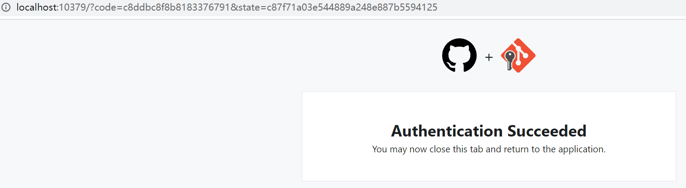

忘性大，记录自己使用过的git命令，防止下回要用的时候又疯狂到网上搜索

### 根据本地仓库搭建github仓库

突然发现本地仓库关联github仓库的两条命令在新建一个项目时github就有提示😓。

## git remote

git remote add origin https://github.com/Lucien98/note2020.git

## git push

git push -u origin master

- git push 命令的结构：git push <远程主机名> <本地分支名>:<远程分支名>（不过貌似上条命令不符合这个结构，冒号去哪里了(・∀・(・∀・(・∀・*)）
- 其中-u参数的全称是--set-upstream，网上的解释我看得云里雾里，但我打算只记这句话：The -u tells Git to remember the parameters, so that next time we can simply run git push and Git will know what to do.

# 2023年
## 4月19日
### bug of sublime
  - when right clicking '.git' folder of repository 'note', sublime exit automatically.

  - But when right clicking .git folder of OptAES1 and OptAes, it does not. 

  - 'note' is currently a project of sublime while the other two are not.

  - When I removed note from projects in sublime, right clicking .git did not make sublime exit.

  - When I add note into sublime(and it is in the bottom of projects in the left side) and right click .git, sublime did not exit.

  - When I moved 'note' above '.git' and right clicked '.git', sublime exit again.

  - And when I reopened sublime, note appears in the bottom of the left side. 

  - The same works for OptAes except that when I reopened sublime, OptAes did not appear in the projects in the left side.

### Who is pushing changes to remote repository? The one in git config? Or the one who has signed in by broswer or using a key prefixed by ghp?

Answer: the latter.

  - When I push the changes to remote repository in github. It raised an error: 
	
	> remote: Permission to Lucien98/note.git denied to TCACEG.
	
	> fatal: unable to access 'https://github.com/Lucien98/note/': The requested URL returned error: 403

  - And I tried to 'switch' account. It did not work.
  	
  	> git config --global user.name Lucien98
 
  - And I tried to figure out who made the last commit. It is Lucien98 again. Then I am curious. Reluctantly, I added TCACEG as colloborator of repository note. Then the pushing succeeded. 

  - When I as TCACEG am added as an colloborator, I read the notice from the web page. And I realized it does not matter in your local machine what is your name. It matters who are granted to the right of pushing changes to the remote repository. More clearly, github recognize you by the key rather than your local setting of username/email.

## 4月21日
### How to push and pull private repository in github.
TCACEG is a colloborator of the private repository 'note', he can clone it via 'git clone https://github.com/Lucien98/note'. 
And while he views the profile of Lucien98, he can see the private repository note of Lucien98. This is because Lucien98 has grant access to TCACEG and maybe in the setting git has already authenticate TCACEG.

So the only problem remained is how to relate a priave repository in github with our local repository.
### ^ in cmd
I decide to change the name of this file from 'git使用.md' into 'how to use git.md'.
After I renamed the file, I tried `git commit -a`, but this is not equal to consectutively execute `git add --all` and `git commit -m `. Git did not track the renamed file, only commit the change that the file 'git使用.md' has been deleted. So I tried to restore to the last commit. I tried `git reset --hard HEAD^` but I get an error:

    E:\Visual Studio 2022\source\repos\note>git reset --hard HEAD^
    More?
    More?
    fatal: ambiguous argument 'HEAD
    ': unknown revision or path not in the working tree.
    Use '--' to separate paths from revisions, like this:
    'git <command> [<revision>...] -- [<file>...]'

But when I tried `git reset --hard HEAD^^`, it worked.

    E:\Visual Studio 2022\source\repos\note>git reset --hard HEAD^^
    HEAD is now at c2351a1 understanding of access to private repository

It is not consistent with the description in [git commit后，如何撤销commit
](https://blog.csdn.net/c46550/article/details/116574128).

The reason is explained in [here](https://blog.csdn.net/voledmort/article/details/100794005), i.e. `^` is parsed as a line break in cmd. More specificly, only the last `^` is parsed as a line breaker.

## 4月23日
  - use clash to push to github
    + set http_proxy=http://127.0.0.1:7890 & set https_proxy=http://127.0.0.1:7890
    + copied from clash > general > port > [icon]Open terminal with proxy set up > copy commands only

## 4月24日
  In windows command, Whenever we use `git config --global https.proxy 'http:127.0.0.1:7890'`, the config did not work immediately.
  In linux shell, it is different.

  In the computer of laboratory, I could access github.com via system proxy, but not `git config`.

## 4月28日
### use gitblit as a git server
#### different protocols used in git
When I create a new repository in gitblit, the following two command appears in the default page of a new repository:

    git remote add origin ssh://lucien98@localhost:29418/TCA-SA.git
    git push -u origin master

When running the command `git push -u origin master`, I consistently get the error:

    Unable to negotiate with ::1 port 29418: no matching host key type found. Their offer: ssh-rsa,ssh-dss
    fatal: Could not read from remote repository.
    
    Please make sure you have the correct access rights
    and the repository exists.

It is because the first command use `ssh` protocol to transfer the data.

And I usually use `https` protocol to transfer data between github and my PC.

The difference between these ways can be seen at https://www.cnblogs.com/yanglang/p/9563496.html

I am not familiar with `ssh` protocol, so I just changed the protocol to `http`, and everything worked very well, just as I am interacting with github.

#### `where` command in windows
To use `ssh` protocol, a first step would be generating ssh keys.
The command is `ssh-keygen`. And I don't know this command actually exists in my PC. And I don't know where is it either. Fortunately, `where` command in windows works as `which` command in linux.

    E:\Visual Studio 2022\source\repos\note>where ssh-keygen
    C:\Windows\System32\OpenSSH\ssh-keygen.exe

The reason why should we config `ssh` is explained in https://blog.csdn.net/weixin_42310154/article/details/118340458. This is a one-way authentication.

## 4月30日 - use ssh to push and pull
### difference of running ` ssh-keygen -t rsa -C "your_emial@examle.com"` with custom file position.

when running this command, the default folder to store ssh key would be `~/.ssh`, while when you enter a filename in 

    Enter file in which to save the key (/c/Users/***/.ssh/id_rsa): f

The file will be stored in the current folder instead of `~/.ssh/`.

For example:

    $  ssh-keygen -t rsa -C "your_emial@examle.com"
    Generating public/private rsa key pair.
    Enter file in which to save the key (/c/Users/***/.ssh/id_rsa): f
    Enter passphrase (empty for no passphrase):
    Enter same passphrase again:
    Your identification has been saved in f
    Your public key has been saved in f.pub
    The key fingerprint is:
    SHA256:Y4oNDF5nlpY**************QZlmhnZJkreCyWzx0 your_emial@examle.com

### Host key verificaiton failed
The  authentication between github and my PC.

Authentication is a 2-way process.

  1. github needs to authenticate my PC.
  2. my PC needs to authenticate github.

The first step is done by the ssh-keygen process mentioned before.
We paste the pubkey to github, so github could anthenticate my PC by verifying my PC has the corresponding private key.

But my PC could not authenticate github.
So I encountered this problem:

    E:\Visual Studio 2022\source\repos\lecroy>git push -u origin main
    The authenticity of host 'github.com (20.205.243.166)' can't be established.
    ED25519 key fingerprint is SHA256:+DiY3wvvV6TuJJhbpZisF/zLDA0zPMSvHdkr4UvCOqU.
    This key is not known by any other names.
    Are you sure you want to continue connecting (yes/no/[fingerprint])?
    Host key verification failed.
    fatal: Could not read from remote repository.
    
    Please make sure you have the correct access rights
    and the repository exists.

The solution is quiet easy: https://blog.csdn.net/Wbiokr/article/details/73431199

    E:\Visual Studio 2022\source\repos\lecroy>git push -u origin main
    The authenticity of host 'github.com (20.205.243.166)' can't be established.
    ED25519 key fingerprint is SHA256:+DiY3wvvV6TuJJhbpZisF/zLDA0zPMSvHdkr4UvCOqU.
    This key is not known by any other names.
    Are you sure you want to continue connecting (yes/no/[fingerprint])? yes
    Warning: Permanently added 'github.com' (ED25519) to the list of known hosts.
    Enumerating objects: 49, done.
    Counting objects: 100% (49/49), done.
    Delta compression using up to 16 threads
    Compressing objects: 100% (42/42), done.
    Writing objects: 100% (49/49), 56.43 KiB | 169.00 KiB/s, done.
    Total 49 (delta 6), reused 0 (delta 0), pack-reused 0
    remote: Resolving deltas: 100% (6/6), done.
    To github.com:Lucien98/lecroy.git
     + [new branch]      main -> main
    branch 'main' set up to track 'origin/main'.

And after we type `yes`, there are two file generated at `~/.ssh/`, i.e. `known_hosts` and `known_hosts.old`

### Connect to Github when `git push`
When I push changes to github via `git push`, the `Connect to Github` window poped out.
There are two methods in the window:

1. Browser/Device
2. Token(Personal access token)

[other] And sometimes, after `git push`, the command asked me to enter my username and password.

In fact, the second method is equivalent to the situation marked as [other].
And we can get the `Personal access token` from settings > Devoloper settings > Personal access tokens > Tokens(classic)

if we cancel the `Connect to Github` dialog, we are asked to sign in with password, actually the `Personal access token`

    E:\2023\mixed things\OptAes>git pull
    fatal: helper error (-1): User cancelled dialog.
    Password for 'https://lucien98@github.com':
    remote: Support for password authentication was removed on August 13, 2021.
    remote: Please see https://docs.github.com/en/get-started/getting-started-with-git/about-remote-repositories#cloning-with-https-urls for information on currently recommended modes of authentication.
    fatal: Authentication failed for 'https://github.com/TCACEG/OptAES.git/'

The following command only works in the current cmd.

    set http_proxy=http://127.0.0.1:7890 & set https_proxy=http://127.0.0.1:7890

To make the environment variable work permanently

    setx http_proxy http://127.0.0.1:7890 & setx https_proxy http://127.0.0.1:7890

It seems everytime I push changes or pull, I should enter this `personal access token`? If it is in the same shell session, then not.
I should keep an eye on it so i will know whether it is true.

after Browser sign in, why the url redirects to `http://localhost:12497/?code=e139c39d22d79cdd1150&state=8a76c4879f3d4f8098c66da997597909`?
At first, the browser could not visit this url, and finally it looks like:
 

## 1st May
### `git stash` and `git branch`
[syntax of git push](https://git-scm.com/docs/git-push)

    git push [--all | --mirror | --tags] [--follow-tags] [--atomic] [-n | --dry-run] [--receive-pack=<git-receive-pack>]
           [--repo=<repository>] [-f | --force] [-d | --delete] [--prune] [-v | --verbose]
           [-u | --set-upstream] [-o <string> | --push-option=<string>]
           [--[no-]signed|--signed=(true|false|if-asked)]
           [--force-with-lease[=<refname>[:<expect>]] [--force-if-includes]]
           [--no-verify] [<repository> [<refspec>…​]]

So `git push -u origin main` matches `git push [-u | --set-upstream] [<repository> [<refspec>...] ]`

    <repository> - origin : The "remote" repository that is destination of a push operation
    <refspec>... - main : Specify what destination ref to update with what source object. Format of <refspec>: +<src>:<dst>
        <src>: local changes to push
        <dst>: which ref in remote side to update, missing `:<dst>` means to update the same ref as the <src>.

So this explains the question raised in the very start of this document - why ":" is missing?

And to record the method of imposing a bibliography in the end of every chapter, I created a new branch. In fact, at first, I thought maybe I could store the changes in my `main` branch, and then I created a new branch then I commit the changes to the new branch. It is not feasible in `git`. After understanding the branch features of git(the method which is very close to solve my problem is [git stash](https://blog.csdn.net/AsheAndWine/article/details/79003270)), I decided to just clone the repository, create a new branch right away and then copy the changes into this new branch and finally commit it. It worked well.
